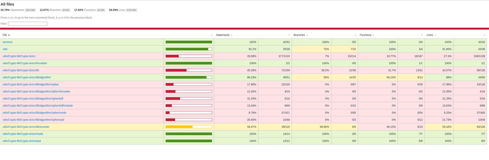

# Car Service App - V2 branch


## 🎯 About
- Created REST-APIs with NodeJS & Express.
- Created Front-End using React.
- Used MongoDB Atlas for database.
- Used JWT.
- There are 3 Roles customer, admin, service_manager  & .
- For more infomration is in the documentation of the project of each role. 

## Technologies Stack Used 

- [React](https://reactjs.org/)
- [TypeScript](https://https://www.typescriptlang.org/)
- [NodeJS](https://nodejs.org/en/)
- [ExpressJS](https://expressjs.com/)
- [MongoDB Atlas](https://www.mongodb.com/cloud)
<!-- - [JsonWebToken](https://github.com/auth0/node-jsonwebtoken#readme) -->


# Documentation

## Table of Contents

- [Introduction](#introduction)
- [Backend Components and API end points](#features)
  <!-- - [App.ts (Main Express App Configuration)](#appts-main-express-app-configuration)
  - [Authentication and Authorization Middlewares](#check-authts-authentication-and-authorization-middlewares) -->
  - [Models](#models)
    - [carModel.ts](#carmodelts)
    - [customerModel.ts](#customermodelts)
    - [userModel.ts](#usermodelts)
    - [orderModel.ts](#ordermodelts)
    - [serviceModel.ts](#servicemodelts)
  - [API-endpoints](#api-endpoints)
  - [Database Schema Documentation](#database-schema-documentation)
  - [Models](#models)
  - [JWT implementation](#jwt-implementation)
- [Coverages](#coverages)
- [Summary](#summary)
- [Run Locally](#run-locally)

## Introduction

The Car Service App V2 enhances the user experience in automotive servicing by integrating various roles within a car service ecosystem. It simplifies the process of ordering, managing, and delivering car services through an intuitive interface supported by a robust backend.

### **Models**

These are mongoose models that represent the data structures in MongoDB. They define the schema and the types for each collection in the database.

#### **carModel.ts**

| Property | Description               |
| -------- | ------------------------- |
| `name`   | Name of the car           |
| `brand`  | Brand of the car          |

#### **customerModel.ts**

| Property   | Description                     |
| ---------- | ------------------------------- |
| `name`     | Name of the customer             |
| `email`    | Email of the customer (must match an email regex) |
| `password` | Password of the customer         |
| `role`     | The role of the user (defaulting to "CUSTOMER") |

#### **mamberModel.ts**

| Property    | Description                     |
| ----------- | ------------------------------- |
| `_id`       | Unique identifier               |
| `name`      | Name of the user                 |
| `email`     | Email of the user                |
| `password`  | Password of the user             |
| `mobile`    | Mobile number of the user        |
| `role`      | The role of the user (defaulting to "MANGER") |
| `status`    | The availability status of the manager (defaulting to "AVAILABLE") |

#### **orderModel.ts**

| Property         | Description                     |
| ---------------- | ------------------------------- |
| `customerId`     | ID of the customer making the order |
| `customerName`   | Name of the customer             |
| `carName`        | Name of the car for which the service is requested |
| `carNumber`      | Number plate of the car         |
| `custAddress`    | Address of the customer         |
| `serviceName`    | The type of service requested   |
| `servicePrice`   | The price of the requested service |
| `managerId`      | ID of the manager assigned to the order |
| `requestedOn`    | Date when the service was requested |
| `deliveredOn`    | Date when the service was completed |
| `status`         | Status of the order (e.g., "Pending", "Completed") |

#### **serviceModel.ts**

| Property      | Description                     |
| ------------- | ------------------------------- |
| `serviceType` | The type of the service (e.g., "Cleaning", "Repair") |
| `name`        | Name of the service             |
| `price`       | Price of the service            |
| `description` | Description of the service      |
| `timeRequired`| Time required to complete the service |
| `where`       | Where the service is performed (e.g., "In-house", "At Customer Place") |

#### **customerModel.ts**

| Property   | Description                     |
| ---------- | ------------------------------- |
| `name`     | Name of the customer             |
| `email`    | Email of the customer (must match an email regex) |
| `password` | Password of the customer         |
| `role`     | The role of the user (defaulting to "CUSTOMER") |


### **API-endpoints**


The section below provides an overview of the various components and APIs in the backend of our application.


### Login (POST)
Login as a memeber, login as a memeber and logint as a user respectively

>General

'Base URL:' http://localhost:8088/admin/auth/

- **Endpoint:** `/login`
- **Payload:** `{ email, password }`
- **Response:** Returns user data and a token. Stores user data to localStorage.

 Register Manager (POST)

- **Endpoint:** `/register`
- **Payload:** `{ name, email, password, mobile }`
- **Response:** Returns a message indicating registration status.

 Register (POST)

- **Endpoint:** `/register`
- **Payload:** `{ name, email, password }`
- **Response:** Initiates user registration.

> Specific cases of usage

#### ADMIN login:

```bash
Login
{
  role: 'ADMIN',
  _id: 651f30fb21f4ce7d8c0cd0d4,
  name: 'Admin',
  email: 'admin@email.com',
  password: '$2b$10$TN/Fs6vdx49NVUhY47BdIOJ.mw/r6FKWU56ptbcHcu77pQER/p2G2',
  __v: 0
}
```

#### MANAGER login

```bash
Login
{
  role: 'CUSTOMER',
  _id: 651f30fc21f4ce7d8c0cd0d5,
  name: 'Manager',
  email: 'user@email.com',
  password: '$2b$10$1t/PNFHPjJdlgjRsCmAgkO1dTI4vu/rdmljRAuW1OO34SzURwLxIq',
  __v: 0
}
```

#### User register:

```bash
Register
{
  role: 'CUSTOMER',
  _id: 652420ad5f3999bba98b1311,
  name: 'Customer',
  email: 'customer@email.com',
  password: '$2b$10$JT0R9mvnp/28IAb5hRzxe.ooaxrn2gbjpKXO1Awk5IjdYIR519dqq',
  __v: 0
}
```


### Customer-services:

> General

The base URL for all customer-related operations is: `http://localhost:8080/customer/`

### Place Order (POST)

- **Endpoint:** `/placeOrder`
- **Payload:** `{ customerId, customerName, carName, carNumber, custAddress, serviceName, servicePrice }`
- **Description:** Places an order for a customer and returns a message indicating the order status.

### Find Customer Orders (GET)

- **Endpoint:** `/findOrders/:id`
- **Description:** Fetches orders placed by a specific customer based on their ID.

### Find Customer By ID (GET)

- **Endpoint:** `/account/findCustById/:id`
- **Description:** Retrieves customer information based on the customer's ID.

> Specific Cases of Usage

#### Placing an Order

To place an order, make a POST request to the following endpoint:

**Endpoint:** `http://localhost:8080/customer/placeOrder`
```json
  {
    "customerId": "123456",
    "customerName": "John Doe",
    "carName": "Car1",
    "carNumber": "123ABC",
    "custAddress": "123 Main St",
    "serviceName": "Service1",
    "servicePrice": 50.00
  }
```

### Car Management

> General:

The main endpoint for car services is: `http://localhost:8088/admin/car-func/`

#### Get All Car Brands (GET)

- **Endpoint:** `/findAllBrands`
- **Description:** Returns a list of all car brands.

#### Get Cars By Brand (POST)

- **Endpoint:** `/findByBrand`
- **Payload:** `{ brand }`
- **Description:** Returns a list of cars by the given brand.

#### Get All Cars (GET)

- **Endpoint:** `/findAll`
- **Description:** Returns a list of all cars.

#### Add Car (POST)

- **Endpoint:** `/addCar`
- **Payload:** `{ name, brand }`
- **Description:** Returns a message indicating car addition status.

#### Update Car (PATCH)

- **Endpoint:** `/updateCar/:carId`
- **Payload:** `{ brand }`
- **Description:** Returns a message indicating car update status.

#### Delete Car (DELETE)

- **Endpoint:** `/deleteCar/:carId`
- **Description:** Returns deletion status.

#### Find Car By ID (GET)

- **Endpoint:** `/findByCar/:carId`
- **Description:** Returns car data by given ID.


> Specific cases of usage:


Main end-point: http://localhost:8088/admin/car-func/

Adding the car: http://localhost:8088/admin/car-func/addCar

```bash
Car Added: {
  name: 'Car1',
  brand: 'cAR1',
  _id: new ObjectId("652485e5defcb11e9b8da963"),
  __v: 0
}
```

Updating the car: http://localhost:8088/admin/car-func/addCar/updateCar/${carId_car_to_update}


```bash
Updated Successfully
Car Added: {
  name: '1Car1',
  brand: '1cAR1',
  _id: new ObjectId("652485e5defcb11e9b8da963"),
  __v: 0Implementation as above
}

```


### Service Management (Package)

> General

http://localhost:8010/admin/car-services/

#### Get All Services (GET)

- **Endpoint:** `/findAll`
- **Response:** Returns a list of all services.

#### Add Service (POST)

- **Endpoint:** `/addService`
- **Payload:** `{ serviceType, name, price, description, timeRequired, where }`
- **Response:** Returns a message indicating service addition status.

#### Update Service (PATCH)

- **Endpoint:** `/updateService/:id`
- **Payload:** `{ id, serviceType, name, price, description, timeRequired, where }`
- **Response:** Returns a message indicating service update status.

#### Delete Service (DELETE)

- **Endpoint:** `/deleteService/:id`
- **Response:** Returns deletion status.

#### Find Service By ID (GET)

- **Endpoint:** `/findById/:id`
- **Response:** Returns service data by given ID.

> Specific Cases

#### Get All Services

To retrieve a list of all available services, make a GET request to the following endpoint:

**Endpoint:** `/findAll`


Response Example (Click to expand)

```json
  {
    "id": "1",
    "serviceType": "Basic Maintenance",
    "name": "Service A",
    "price": 50.00,
    "description": "Basic maintenance for your car.",
    "timeRequired": "1 hour",
    "where": "In-shop"
  },
  {
    "id": "2",
    "serviceType": "Advanced Repair",
    "name": "Service B",
    "price": 100.00,
    "description": "Advanced repair for your car.",
    "timeRequired": "2 hours",
    "where": "On-site"
  }
```

#### Add Service
To add a new service, make a POST request to the following endpoint:

Endpoint: '/addService'

```json
{
  "serviceType": "Basic Maintenance",
  "name": "Service C",
  "price": 60.00,
  "description": "Basic maintenance for your car.",
  "timeRequired": "1 hour",
  "where": "In-shop"
}
```

Response: Service Added Successfully

#### Update Service

To update an existing service, make a PATCH request to the following endpoint by replacing :id with the actual service ID:

Endpoint: '/updateService/:id'
```json
{
  "id": "1",
  "serviceType": "Basic Maintenance",
  "name": "Updated Service A",
  "price": 55.00,
  "description": "Updated basic maintenance for your car.",
  "timeRequired": "1 hour",
  "where": "In-shop"
}

```
Response: Service Updated Successfully

#### Delete Service

To delete a service, make a DELETE request to the following endpoint by replacing :id with the actual service ID:

Endpoint: /deleteService/:id

Response: Service Deleted Successfully

#### Find Service 

To find a service by its ID, make a GET request to the following endpoint by replacing :id with the actual service ID:

Endpoint: '/findById/:id'

```json
{
  "id": "1",
  "serviceType": "Basic Maintenance",
  "name": "Updated Service A",
  "price": 55.00,
  "description": "Updated basic maintenance for your car.",
  "timeRequired": "1 hour",
  "where": "In-shop"
}

```

#### Admin Orders

> General


> Specific cases

To retrieve a list of all placed orders, make a GET request to the following endpoint:

Admin Orders Endpoint: http://localhost:8010/admin/order/findPlacedOrder

```json
  {
    "orderId": "1",
    "customerId": "12345",
    "managerId": null,
    "orderStatus": "Placed",
    "createdAt": "2023-10-10T12:00:00Z"
  },
  {
    "orderId": "2",
    "customerId": "54321",
    "managerId": null,
    "orderStatus": "Placed",
    "createdAt": "2023-10-11T14:30:00Z"
  }

```

#### Assign Order to Manager
To assign an order to a manager, make a PATCH request to the following endpoint:

Endpoint: 'http://localhost:8010/admin/order/updateOrder/:orderId'

```json
{
  "managerId": "exampleManagerId"
}

```

Response:

```json
{
  "message": "Order assigned to manager successfully."
}


```

#### Get Completed Orders

To retrieve a list of all completed orders, make a GET request to the following endpoint:

Endpoint: 'http://localhost:8030/order/findCompletedOrders'

Response:
```json
{
    "orderId": "3",
    "customerId": "67890",
    "mangerId": "manger314",
    "orderStatus": "Completed",
    "completedAt": "2023-10-12T15:45:00Z"
  },
  {
    "orderId": "4",
    "customerId": "98765",
    "managerId": "manager314",
    "orderStatus": "Completed",
    "completedAt": "2023-10-13T10:15:00Z"
  }

```

## JWT implementation


> JWT Implementation

In our application, we have implemented our own version of JSON Web Tokens (JWT) for authentication purposes. This solution is an alternative to the standard libraries available for JWT, crafted specifically for our needs.

> How it Works:

1. **Header**: The header typically consists of two parts: the type of the token (JWT) and the hashing algorithm being used (e.g., HS256). We encode this in base64 format.
2. **Payload**: The second part of the token is the payload, which contains the claims. Claims are statements about the user and additional metadata. We have also added an expiration claim (`exp`) which specifies when the token expires. We encode this in base64 format.
3. **Signature**: For the signature, we take the encoded header, the encoded payload, a secret, and then use the HMAC SHA256 algorithm to hash them together. This ensures that the message hasn't been changed along the way.

> Code Implementation:

> Creating a JWT:

```typescript

import * as tsCryptoLib from './Crypto-lib/Crypto-ts/src/HmacSHA256';
import { Base64, Hex, Utf8, Word32Array, Word64Array } from './Crypto-lib/Crypto-ts/src';


const secret = '31415926535898_superSuperSecretKey';  // Ensure to keep this secret very secure.

export const createJWT = (payload: object, expiresIn: number): string => {
  // ... [more specific side of implementation is in the utils/jwtutil.ts]
};
```

> Verifying a JWT:

Verifying the token involves decoding it and ensuring the signature matches. Additionally, we check if the token has expired.

```typescript
export const verifyJWT = (token: string): any => {
  // ... [more specific side of implementation is in the utils/jwtutil.ts]
};
```

> Security Concerns:

- The secret used in hashing the JWT should be kept private. Exposure can lead to JWTs being forged.
  
- The JWT does not encrypt the payload or the header. If there's any sensitive information, consider another method of transmitting it or use encryption methods in combination with JWT.

- Ensure the expiration time (`exp` claim) is set appropriately to balance between user convenience and security.

> Conclusion:

Our JWT implementation provides a robust method for ensuring secure authentication in our application. Always validate JWTs server-side and never trust information from a client without verification.


## Database Schema Documentation

This document provides an overview of the MongoDB schema used in the system. Each table represents a collection within the MongoDB database, detailing the fields, data types, and descriptions of their roles within the application.

## Collections

Below are the collections defined in the MongoDB database, along with their respective schemas.

### `Cars`
| Field  | Type   | Description          | Unique | Required | Default |
|--------|--------|----------------------|--------|----------|---------|
| `name` | String | Name of the car      | Yes    | Yes      | N/A     |
| `brand`| String | Brand of the car     | No     | Yes      | N/A     |

### `Customers`
| Field     | Type   | Description                             | Unique | Required | Default     |
|-----------|--------|-----------------------------------------|--------|----------|-------------|
| `name`    | String | Name of the customer                    | No     | Yes      | N/A         |
| `email`   | String | Email address of the customer           | Yes    | Yes      | N/A         |
| `password`| String | Encrypted password for the account      | No     | Yes      | N/A         |
| `role`    | String | Role of the customer within the system  | No     | No       | "CUSTOMER"  |

### `Members`
| Field     | Type   | Description                             | Unique | Required | Default     |
|-----------|--------|-----------------------------------------|--------|----------|-------------|
| `_id`     | ObjectID | Unique identifier for the user        | Yes    | Yes      | N/A         |
| `name`    | String | Name of the user                        | No     | Yes      | N/A         |
| `email`   | String | User's email address                    | Yes    | Yes      | N/A         |
| `password`| String | Encrypted password for the account      | No     | Yes      | N/A         |
| `mobile`  | String | Mobile number of the user               | No     | No       | N/A         |
| `role`    | String | User's role within the system           | No     | No       | "MANAGER"  |
| `status`  | String | Manager's availability status          | No     | No       | "AVAILABLE" |

### `Orders`
| Field          | Type     | Description                                     | Unique | Required | Default   |
|----------------|----------|-------------------------------------------------|--------|----------|-----------|
| `customerId`   | ObjectID | Reference to the customer placing the order     | No     | Yes      | N/A       |
| `customerName` | String   | Name of the customer                            | No     | Yes      | N/A       |
| `carName`      | String   | Name of the car for service                     | No     | Yes      | N/A       |
| `carNumber`    | String   | License plate of the car                        | No     | Yes      | N/A       |
| `custAddress`  | String   | Customer's address                              | No     | Yes      | N/A       |
| `serviceName`  | String   | Type of service requested                       | No     | Yes      | N/A       |
| `servicePrice` | Number   | Price of the service                            | No     | Yes      | N/A       |
| `managerId`   | ObjectID | Reference to the manager assigned to the order | No     | No       | N/A       |
| `requestedOn`  | Date     | Date when the service was requested             | No     | Yes      | `Date.now`|
| `deliveredOn`  | Date     | Date when the service was delivered             | No     | No       | N/A       |
| `status`       | String   | Current status of the order                     | No     | Yes      | N/A       |

### `Services`
| Field         | Type   | Description                             | Unique | Required | Default                 |
|---------------|--------|-----------------------------------------|--------|----------|-------------------------|
| `serviceType` | String | Type of service (e.g., "Cleaning")      | No     | Yes      | N/A                     |
| `name`        | String | Unique name of the service              | Yes    | Yes      | N/A                     |
| `price`       | Number | Cost of the service                     | No     | Yes      | N/A                     |
| `description` | String | Brief description of the service        | No     | Yes      | N/A                     |
| `timeRequired`| String | Estimated time to complete the service  | No     | Yes      | N/A                     |
| `where`       | String | Location of service performance         | No     | Yes      | N/A                     |


This schema overview represents the current state of the MongoDB collections and their fields as of [last update date]. The schema is subject to change as the application evolves.

## **Coverages**

`Admin` microservice coverage status:




## **Summary**

The Car Service App V2 is not just an upgrade in technology but also an enhancement in operational efficiency and user experience. The app is designed to cater to the diverse needs of the car service industry, enabling all stakeholders to interact in a cohesive and efficient ecosystem.

Stay tuned to this space for any updates or new features that will be rolled out. Your feedback is invaluable to us as we strive to improve and evolve the Car Service App V2.


SERVICES FOR EACH ROLE

CUSTOMERS:

1. Sign-Up/Login
2. Choose a CAR from Car Categories/ Enter Car Details: Enter car details like make, model name, year, color and other details to pick the right car wash service.
3. Custom Pricing: The feature lets users choose plans from deluxe or premium car wash services as per their car & range.
4. Add-ons Services: Besides the fixed package services, customers can avail additional services by adding them from Add-ons services, if they want.
5. Payment Summary: Users can get immediate payment summary for the services received.
6. Book-A-Wash
7. Wash Status: Get the update of car’s wash status: done, in progress or in queue.
8. My Washes: Users can view the timeline of all car washes that they have carried out

Managers: 

1. Login## Authenctication - server-side JWT (implementation assumption)
2. Wash Request: Wash Request is sent to the washer along with the user details. The washer can either accept or decline the request..
3. Profile: Washers can view and update their profile information.
4. My Orders: Washers can also view their past and current orders

ADMIN: 

1. Washer/Manager Management: Add/Edit Washer Details
2. Car Management: Add/Edit Car Details
3. Service Plan Management: Add/Edit Plans and Service Add-ons
4. Order Management: View Order Details and assign pending requests to washers
5. Report Management: Admin can generate and filter reports based on orders, washers, dates


## Run Locally

- To clone the Project

```bash
  git clone  ... the repo ...
```
- Go to Client directory to run the frontend

```bash
  cd Client/automitive_service_app
```
- To Run the frontend
```bash
  nvm use 18 && npm install && npm start
```

## Auth:
user      |           email |        password |
|---------|-----------------|-----------------|
admin     | admin@email.com | admin3141592    | 
customer  |  test@email.com |  test3141592    |    
manager   | user@email.com  |  user3141592    |

### For Back-End

#### Configure your Database with NodeJs

- Go to the Back-End project directory

```bash
  cd Server
```
- There are 4 Microservices
- Inside each Microservice a dbConfig.js file is there in config folder. Inside that you have to provide your database credentials.
- Install dependencies for each Microservice (Admin, Customer, Manager, Order).

```bash
  cd Admin
```

```bash
nvm use 18 && npm install
```
- Start the server of all Microservices.

```bash
  node Server.js # or the next like is far more comfortable for the specific reason 
  npm start
```

- For the ADMIN access you need to insert a record mannually in the members database as a role ADMIN. 

## User login

ADMIN user_name: admin@email.com
ADMIN password: admin3141592

MANAGER user_name: user@email.com
MANAGER password: user3141592

CUSTOMER user_name: test@email.com
CUSTOMER password: test3141592

### Docker section: it will be optimized later

To run the whole application with the Docker, run the next comand from the root directory of the project:
```bash
docker-compose up 
```
## Dev plan(for developers)
- [x] admin microservice
- [x] manager microservice
- [x] customer microservice
- [x] order microservice
- [ ] nice frontend-side implementing the api enpoints calls
- [x] migrating to git
- [x] migrating services to git
- [x] updating js to ts in the Server-side
- [ ] check the auth headers in the client
- [ ] frontend update
- [ ] updating the docker-compose 
- [ ] adding the tests
- [ ] Do not use the 'jsonwebtoken' 
  - [ ] craft own JWT
  - [ ] Use the JSON.Parse && JSON.Stringify implemented in the 'tasks/task13/task' fomm the  'node_laba_course' repository
